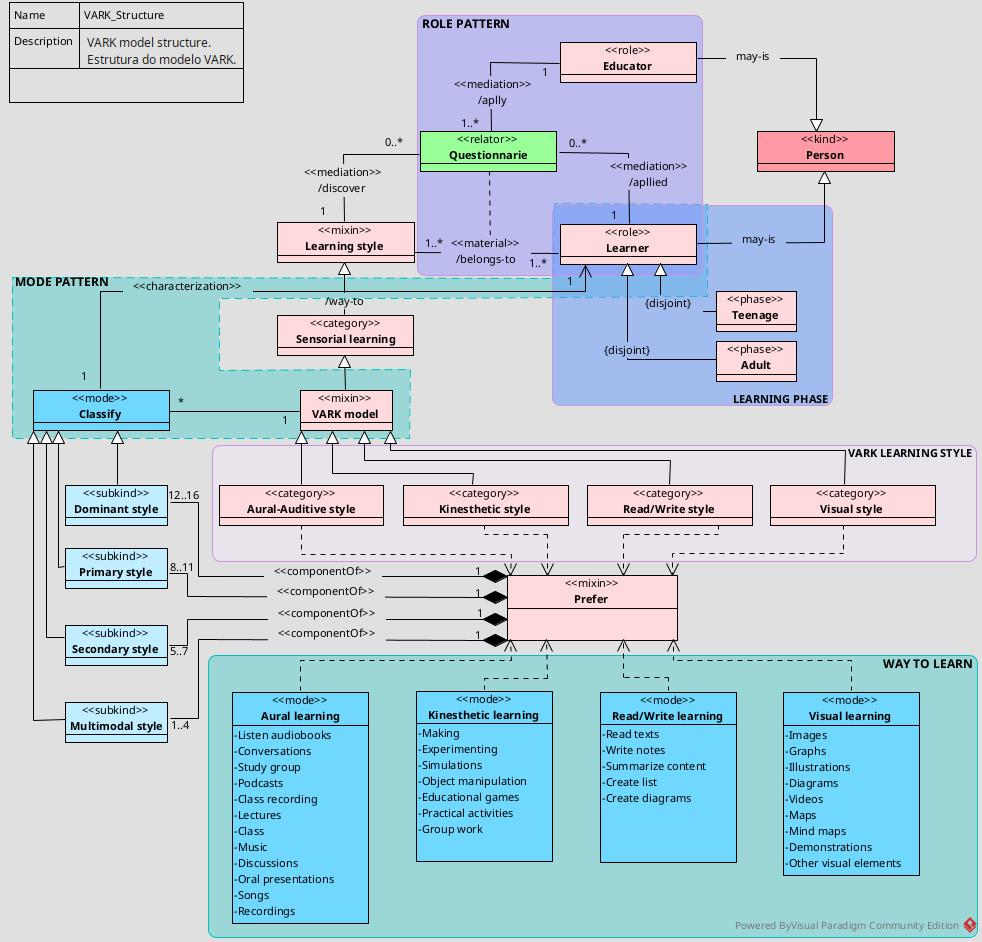
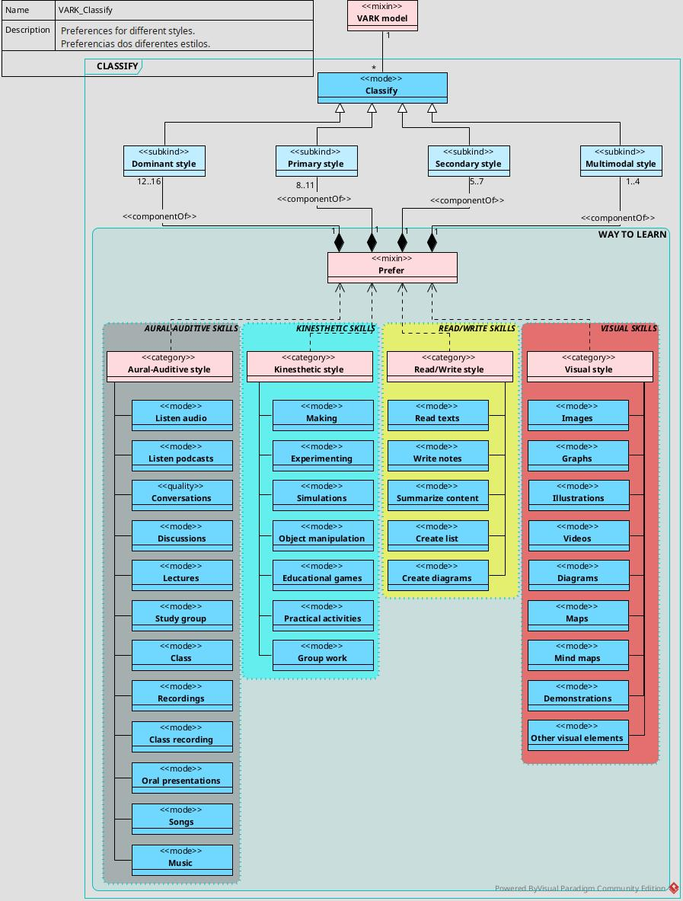
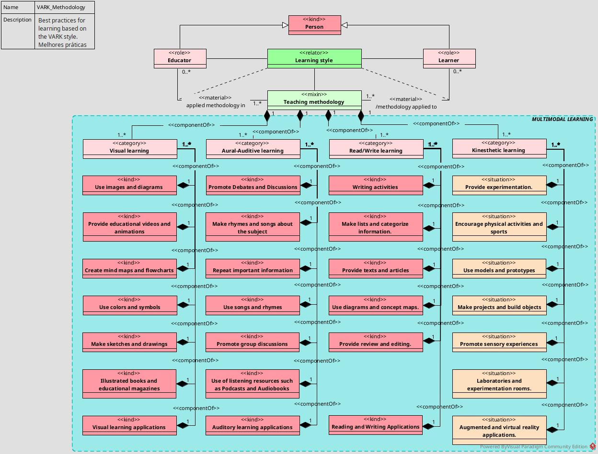

Ontologia do modelo de aprendizagem sensorial VARK, desenvolvido pelo professor Neil D. Fleming.
=========================================================================================================

#  Sobre este trabalho
Este trabalho tem com proposito apresentar uma proposta de **ontologia** do **modelo**/estilo de **aprendizagem** sensorial **VARK** do professor Neil D. Fleming.

Este trabalho fora elaborado pelo mestrando David Franklin, como forma de obtenção de nota parcial na disciplina de Tópicos Especial em Engenharia de Software e Sistemas Computacionais I, ministrada pelo Professor Doutor Patrício de Alencar Silva, no Programa de Pós-Graduação em Ciência da Computação (PPgCC) Uern-Ufersa, em nível de _stricto sensu_ (mestrado).

==========================================================================================

# **VARK model learning**
O modelo VARK foi desenvolvido por Neil D. Fleming em 1987, com o objetivo de ajudar educadores a entender como os alunos aprendem melhor.
É uma teoria de estilos de aprendizagem, voltada para categorizar preferências sensoriais e de abordagem no processo de aprendizagem. O acrônimo "VARK", em inglês, representa quatro estilos principais: Visual (Visual), Auditivo (Auditive), de Leitura/Escrita (Read/Write) e Cinestésico (Kinesthetic), cada um deles refletindo diferentes maneiras pelas quais as pessoas processam e absorvem informações. A aplicação do modelo VARK é útil, sobretudo em contextos educacionais e profissionais, pois permite personalizar métodos de ensino e facilitar o aprendizado ao alinhar os métodos de estudo com as preferências de cada pessoa.

## **Os 4 estilos**

1. ***Visual (Visual):***
Aprendizes visuais aprendem melhor vendo. Seja através de imagens, gráficos, diagramas, ilustrações, mapas, mapas mentais, demonstrações, vídeos e outros elementos visuais. 
Estes aprendizes geralmente preferem "ver" o conteúdo e fazem conexões por meio de representações visuais que permitem estruturar o conhecimento em blocos de informações facilmente acessíveis.
Costumam ser mais observadores e gostam de ter uma visão geral dos assuntos.
Gostam de observar demonstrações.

2. ***Auditivo (Auditive):***
Também encontramos na literatua o termo **Aural** (em inglês), para se referir aos aprendizes auditivos. Eles aprendem melhor com sons ou ouvindo. Seja através de palestras, conversas, discussões, apresentações orais, podcasts, músicas ou gravações;
Estes aprendizes retêm bem o conteúdo ao escutar ou ao se engajar em debates e atividades interativas.
Em geral, para essas pessoas, a compreensão é mais eficiente ao ouvir explicações e contextualizar ideias por meio de conversação.
Costumam ser bons ouvintes e se beneficiam de explicações verbais.
Gostam de ouvir explicações.

3. ***Leitura/Escrita (Read/Write):***
Aprendizes Leitores/Escritores aprendem melhor lendo e escrevendo. Seja através de ler textos, escrever anotações, resumir o conteúdo e criar listas e esquemas.
Esse estilo está associado à preferência por ler e escrever como método principal de assimilação do conhecimento.
A escrita e a leitura permitem-lhes organizar ideias de maneira linear, o que facilita a memorização e o entendimento do conteúdo.
Eles gostam ler, escrever, tomar notas, fazer resumos e criar listas.

4. ***Cinestésico (Kinesthetic):***
Aprendizes cinestésicas aprendem melhor fazendo e experimentando. Seja por meio de simulações, manipulação de objetos, jogos educativos, entre outros.
Beneficiam-se mais ao realizar atividades práticas que envolvam interação física e experiência direta. 
A prática e o envolvimento sensorial tornam a compreensão mais profunda e significativa, o que é especialmente útil em áreas como medicina, artesanato, engenharia e outros campos que exigem prática e experimentação.
Elas gostam de fazer, experimentar, atividades práticas, experimentos ou trabalhos em grupo.

##  Como identificar os estilos
Para identificar a qual estilo de aprendiagem uma pessoa pertence é necessario responder ao questionário desenvolvido por Fleming.
Atualmente, o questionário está na [versão 8.02](https://vark-learn.com/the-vark-questionnaire/) e disponível no web site [VARK-Learn](https://vark-learn.com) mantido por apoiadores do professor Fleming.

==========================================================================================

# **SOBRE A ONTOLOGIA**

##  Propósito
Esta ontologia tem como objetivo propor uma possível visão, não definitiva, do modelo de aprendizagem sensorial VARK. Estruturando o modelo de forma a melhorar a percepção dos estilo de aprendizagem dos aprendizes em todos os níveis educacionais (educação básica e superior) previstas nos incisos I e II do Art. 21 da lei 9.394/1996 ([Lei de Diretrizes e Bases da Educação no Brasil - LDB](https://www.planalto.gov.br/ccivil_03/LEIS/L9394compilado.htm)), bem como dos educadores e docentes. Através dessa compreenção, o aprendiz poderá otimizar o modo como aprende e os educadores e docentes prover uma melhor experiência do estudos aos seus aprendizes.

##  Linguagens
Esta ontologia foi desenvolvida em duas linguagens complementares.
A primeira em _OntoUML_. Cujo o objetivo foi dar uma maior abstração dos termos, terminologias e aspectos das partes e artefatos envolvidos no processo de reconhecimento do estilo.
O segundo em _OWL_. Aqui, o objetivo é consolidar as interações entre os agentes, artefatos e aspectos do modelo VARK.

==========================================================================================
### **Modelo OntoUML**

Para modelagem em _OntoUML_, utilizou-se o software [__Visual Paradigm (v17.2)__](https://www.visual-paradigm.com/download/community.jsp) e o [_plugin OntoUML_](https://github.com/OntoUML). Do qual, foram confeccionados 3 visões para explicar o modelo VARK. São eles:

***Estrutura do modelo VARK***
Aqui, mostra-se uma visão geral do modelo/estilo de aprendizagem VARK. Distinguido os agentes envolvidos, bem como, suas relações.

***Classificação dos estilos***
Esta visão tem o foco em como se pode classificar os aprendizes de acordo com sua habilidades. Distinguindo se o aprendiz tem um estilo **Dominate**, **Primário**, **Secundário** ou é do tipo **Multimodal** (quando tem competências em grau significativo nos quatro estilos).

***Metodologia de ensino***
Esta visão tem como objetivo descrever as melhores práticas que os educadores e docentes podem promover em suas aulas para os diferentes estilos do modelo VARK.

==========================================================================================

### **Modelo OWL**
Após a confecção do modelo em _OntoUML_, fez-se exportação do modelo para extensão _Turtle (.ttl)_ no __Visual Paradigm__.
Com base no arquivo _OntoUML_, foi modelado o arquivo e _OWL_ no software [**Protégé**](https://protege.stanford.edu/).

==========================================================================================
